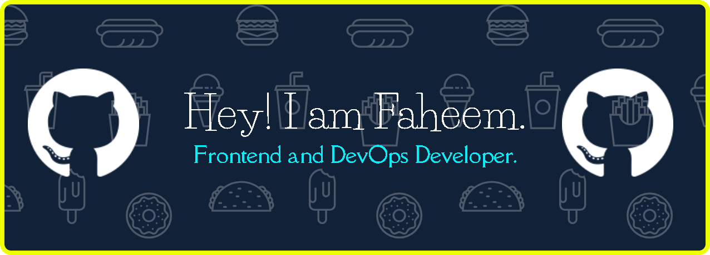

<h1 align="center">Hi 👋, I'm Faheem Ahmad Khan</h1>
<h3 align="center">QA Engineer | Manual & Automation Testing | Python, Pytest, Jira</h3>

  

- 🔍 I love finding bugs before users do — test case design, exploratory testing, and clear bug reports are my focus
- 🤖 Building automation skills with **Python + Pytest**, picking up **Selenium** and **Playwright** next
- 📋 I plan and track testing work in **Jira**, following **Agile/Scrum**
- 🧑‍💻 Started in web development (**React, JavaScript**) — understanding how software is built makes me a sharper tester
- 💬 Ask me about **QA, Test Automation, or Agile/Scrum**
- 📫 How to reach me: **faheem6146ahmad@gmail.com**
- 📄 Know about my experience: [Resume](https://docs.google.com/document/d/1RZuQu_p8dE9BsRk2VmvlOxbB3EUXNawoE69IwnjjpGA/edit?usp=sharing)
- ⚡ Fun fact: **Gaming + Coding = Happy Combo.**

<h3 align="left">Connect with me:</h3>

<h3 align="left">QA & Testing Tools:</h3>

<h3 align="left">Other Tools & Languages:</h3>

              

&nbsp;

